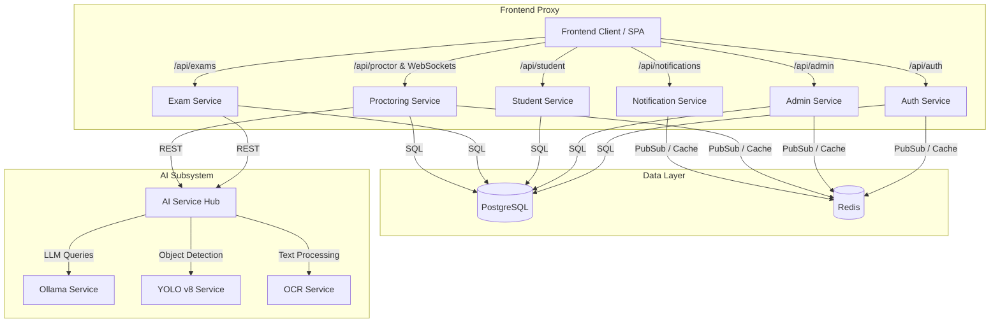
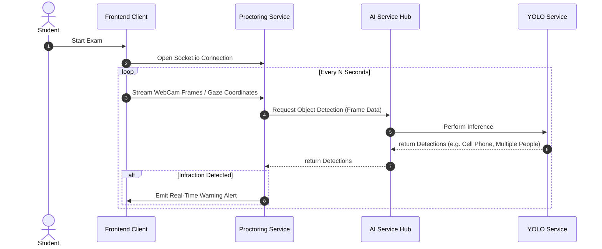
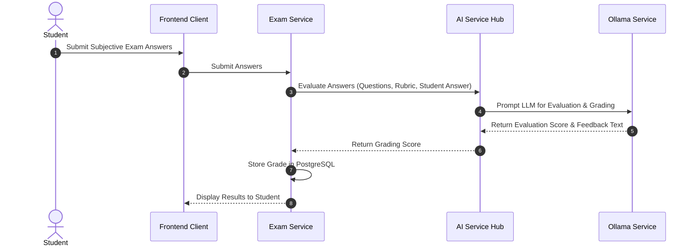

# Clahan Academy - Application Architecture

This document outlines the software and application-level architecture of the Clahan Academy Online Exam Platform. The application is built using a highly decoupled microservices architecture to support real-time proctoring, AI-assisted grading, and platform administration.

---

## 🏗️ High-Level Application Flow

The system consists of a Frontend Single Page Application (SPA), a central AI Hub Service coordinating specialized ML models, and multiple domain-specific microservices backed by relational database and memory cache layers.

---

## 📦 Microservices Breakdown

### 1. Frontend Service (`frontend-service`)
* **Role**: Serves the user interface and proxies API endpoints.
* **Responsibilities**:
  * Renders dashboards for students, teachers, and administrators.
  * Captures real-time camera/gaze streams and desktop screens during proctored exams.
  * Proxies API traffic under `/api/*` to the respective backend microservices.

### 2. Authentication Service (`auth-service`)
* **Role**: Identity and Access Management.
* **Responsibilities**:
  * Handles user registration, login, and profile management.
  * Generates and validates stateless JWT Access Tokens and stateful Refresh Tokens.
  * Triggers and verifies one-time password (OTP) verification codes via email.

### 3. Administrator Service (`admin-service`)
* **Role**: Admin console and configurations.
* **Responsibilities**:
  * Manages global system settings and permissions.
  * Facilitates administrative dashboard data and user access controls.

### 4. Student Service (`student-service`)
* **Role**: Student record management.
* **Responsibilities**:
  * Manages student profile information, study records, and registration details.
  * Retains student performance records and platform engagement metrics.

### 5. Exam Service (`exam-service`)
* **Role**: Exam management lifecycle.
* **Responsibilities**:
  * Creates, schedules, and archives online examinations.
  * Maintains question banks, choices, and scoring rules.
  * Interfaces with the `ai-service` to perform automated subjective grading and evaluation.

### 6. Proctoring Service (`proctoring-service`)
* **Role**: Real-time exam integrity monitoring.
* **Responsibilities**:
  * Manages live websocket connections (via `socket.io`) to capture proctoring signals.
  * Periodically sends student webcam frames and behavioral data to the `ai-service`.
  * Generates real-time infraction alerts (e.g. "multiple people detected", "absence detected").

### 7. Notification Service (`notification-service`)
* **Role**: Communication engine.
* **Responsibilities**:
  * Dispatches transaction notifications, OTP validation codes, and registration confirmations.
  * Uses queue structures in Redis to handle asynchronous email dispatch.

---

## 🧠 AI Subsystem Architecture

The **AI Service Hub (`ai-service`)** acts as an orchestration router. Rather than holding model weights directly, it directs requests to specialized, isolated backend model instances:

1. **Ollama LLM Service**: Runs large language models locally for subjective answer grading, evaluation of student responses, and question generation.
2. **YOLO v8 Object Detection Service**: Performs visual object detection on proctoring webcam feeds to detect mobile phones, books, multiple people, or gaze deviation.
3. **OCR Service**: Translates hand-written answers or exam paper scans into digital text for grading.

---

## 🔄 Core Application Workflows

### Real-Time Proctoring Workflow

### AI-Assisted Grading Workflow

---

## 🛠️ Technology Stack Matrix

| Service | Language / Runtime | Core Libraries / Frameworks | Data Stores |
| :--- | :--- | :--- | :--- |
| **Frontend** | Node.js (Vite) | React, TailwindCSS, Socket.io-Client | LocalStorage / Cache |
| **Auth** | Node.js | Express, jsonwebtoken, bcrypt | PostgreSQL, Redis |
| **Admin** | Node.js | Express | PostgreSQL, Redis |
| **Student** | Node.js | Express | PostgreSQL |
| **Exam** | Node.js | Express, Axios | PostgreSQL |
| **Proctoring** | Node.js | Express, Socket.io | PostgreSQL, Redis |
| **Notification**| Node.js | nodemailer, Bull (Redis Queue) | Redis |
| **AI Hub** | Python | FastAPI, Uvicorn | None (Stateless) |
