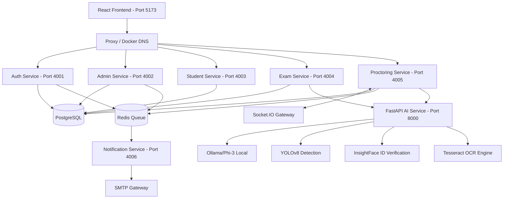

# CLAHAN ACADEMY V2 — ENTERPRISE DEPLOYMENT & SYSTEMS WALKTHROUGH

> [!NOTE]
> Clahan Academy V2 is a fully decoupled microservice architecture engineered for high throughput (10,000+ simultaneous students). It includes real-time video/tab proctoring and local AI evaluation.

---

## 1. System Architecture Map

The system consists of 8 microservices, backed by PostgreSQL and Redis:



---

## 2. Microservices Reference

| Microservice | Language/Tech | Exposed Port | Primary Responsibilities |
| :--- | :--- | :--- | :--- |
| **`auth-service`** | Node.js, TS, Express | `4001` | JWT Generation, DDL Schema Auto-Generation, Seed default admin credentials (`admin@clahan.com` / `Admin@123`), SMTP OTP registration validation. |
| **`admin-service`** | Node.js, TS, Express | `4002` | Onboard colleges/departments, bulk parse candidate CSVs, reset passwords, metric aggregation. |
| **`student-service`** | Node.js, TS, Express | `4003` | Active/upcoming exam listings, profile customization. |
| **`exam-service`** | Node.js, TS, Express | `4004` | Exam CRUD, MCQ configuration, coding compiler wrapping, automated marking. |
| **`proctoring-service`**| Node.js, TS, Socket.IO| `4005` | Real-time WebSocket proctor room tracking, visibility loss warnings, termination. |
| **`notification-service`**| Node.js, TS, Worker | `4006` | Pulls notifications from Redis, compiles styled emails, delivers via SMTP. |
| **`ai-service`** | Python, FastAPI, Uvicorn| `8000` | Orchestrates YOLOv8 cell phone detection, InsightFace, Tesseract OCR, and Ollama feedback. |
| **`frontend-service`** | React, Vite, TS, Tailwind | `5173` | Rich user dashboard, camera verification pipeline, split MCQ/Code editor assessment IDE. |

---

## 3. Local & Containerized Setup

### Option A: Local Dev Build (Micro-Services Running Concurrently)
To run services in local dev modes, you need to set up environment files (`.env`) in each microservice pointing to localhost databases.

1. Install dependencies for all services:
   ```bash
   # In root folder:
   cd auth-service && npm install
   cd ../admin-service && npm install
   cd ../student-service && npm install
   cd ../exam-service && npm install
   cd ../proctoring-service && npm install
   cd ../notification-service && npm install
   cd ../frontend-service && npm install
   ```

2. Start dependencies (PostgreSQL & Redis) locally or via simple docker containers.
3. Start the services:
   ```bash
   npm run dev
   ```

### Option B: Production Container Deployment (Docker Compose)
From the root workspace folder, run:
```bash
docker-compose up --build -d
```
This builds multi-stage containers and launches Postgres, Redis, all Node.js APIs, the Python FastAPI gateway, and the Nginx-based React production frontend.

---

## 4. SMTP and Gmail Setup

Gmail requires setting up an **App Password** for `aiexamplatform123@gmail.com`:
1. Log into Google Account Management.
2. Search for **App Passwords** in Security.
3. Generate a 16-character key.
4. Replace `SMTP_PASS` value inside [docker-compose.yml](file:///c:/Users/91901/OneDrive/Desktop/clahan%20academy/docker-compose.yml) or environment configs:
   ```yaml
   SMTP_PASS: "your_16_character_app_password"
   ```

---

## 5. Administrative Seeding Instructions

When the database is initialised, the auth service automatically inserts the default credentials:
- **Admin Email**: `admin@clahan.com`
- **Admin Password**: `Admin@123`

On logging in, the administrator can:
1. **Onboard Colleges & Departments**: Set up eligible target organizations.
2. **Import Students via CSV**: In the Student tab, upload using the template format:
   ```csv
   Full Name,Email,Phone,Roll Number,College,Department,Year
   Arjun Kumar,arjun@college.edu,9876543210,CSE2026-08,ABC Engineering College,CSE,3rd Year
   ```
3. **Configure Exams & Questions**: Add MCQ options and Coding algorithm test suites.

---

## 6. AI Proctoring & Violation Rules Engine

The proctoring system enforces strict, automated verification policies combining in-process Haar Cascade face classifiers, YOLOv8 object detection, and wall-clock duration-based tracking.

### A. Pre-Exam Verification Handshake
To prevent exams starting without proper verification, the frontend captures live webcam frames and sends them to the `/api/proctor/verify-face` endpoint:
1. **Verification Requirement**: A student must have exactly **1 face** present in the camera view with **no active objects** (phones/books) to pass.
2. **Auto-Retry Loop**: Detections are retried automatically every 2 seconds for up to 30 seconds.
3. **Manual Override**: If verification times out (e.g. poor lighting), a **"Retry Face Verification"** button allows the student to re-trigger the check manually. The student cannot proceed to fullscreen or start the exam until verification completes.

### B. Frame Preprocessing (Letterboxing)
To prevent YOLOv8 input aspect ratio distortion (which drops cell phone detection confidence), frames are preprocessed using a **Letterboxing** technique:
- The input image is scaled to fit inside a `640x640` square canvas.
- A neutral grey padding (`114` intensity) is applied on the sides or top/bottom.
- This preserves the native shape of target objects (like phones and books) for accurate detection.

### C. Live Exam Violations & Termination Policies

| Violation Type | Detection Mechanism | Severity / Action | Auto-Termination Trigger |
| :--- | :--- | :--- | :--- |
| **`NO_FACE_DETECTED`** | Frontal + Profile Cascade with YOLO Fallback | **Warning (>10s)**: Socket warning alerts.<br>**Log (>20s)**: Inserts Warning log to DB.<br>**Critical (>30s)**: Terminates exam attempt. | 30 continuous seconds of face absence (wall-clock duration). |
| **`MULTIPLE_FACES_DETECTED`** | Haar Cascades / YOLOv8 | **Warning (Frame 1)**: Immediate DB Log / Socket Warning.<br>**Critical (Frame 5)**: Terminates exam. | 5 consecutive frames showing $\ge 2$ people. |
| **`MOBILE_PHONE_DETECTED`** | YOLOv8 (Class index 67) | **Warning (Frames 1-4)**: Log details with confidence % to DB / Socket Warning.<br>**Critical (Frame 5)**: Terminates exam. | 5 consecutive frames with cell phone confidence $> 0.80$. |
| **`BOOK_DETECTED`** | YOLOv8 (Class index 73) | **Warning (Frames 1-7)**: Log details with confidence % to DB / Socket Warning.<br>**Critical (Frame 8)**: Terminates exam. | 8 consecutive frames with book confidence $> 0.40$. |
| **`TAB_SWITCH`** | Client Window Blur / Visibility API | **Warning (Switches 1-2)**: Warning popup.<br>**Critical (Switch 3)**: Terminates exam. | 3 cumulative tab switches during the session. |
| **`FULLSCREEN_EXIT`** | HTML5 Fullscreen API | **Warning (Exits 1-2)**: Overlay lock / Warning.<br>**Critical (Exit 3)**: Terminates exam. | 3 cumulative exits from fullscreen mode. |
